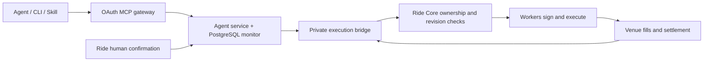

# Ride MCP · CLI · Skill

Ride Agent V3 selects a diversified trader basket and manages owned Perps and prediction-market copies. It exposes fifteen MCP tools, equivalent JSON CLI commands, compact MCP App cards, and a portable agent Skill.

**Release status:** the hosted V3 endpoint is `https://mcp.onride.me/mcp`. Account readiness and Ride approval govern trading. The npm registry package is not published yet; use the pinned GitHub distribution below.

## One-command installation

Node.js 20+, npm and your chosen AI client are required. Install the Skill, connect the production MCP and start login in one command:

```sh
npx -y github:Glen-yang/ride-mcp#v0.3.0 setup --client codex --trade
```

Complete login and authorization with your own Ride account in the browser, then restart Codex or open a new chat. Codex uses native HTTP MCP and its own OAuth credential storage. If the Codex CLI is absent, setup runs the official `@openai/codex@0.162.0` CLI through npx automatically; no separate global CLI installation is needed.

Use `--client claude-code` or `--client cursor` for those clients; their stdio MCP uses this pinned Ride CLI and its private OAuth session. Setup logs in automatically for all three clients. `--trade` requests read and proposal access; omit it for read access. Execution still requires Ride approval. `--server https://YOUR-RIDE-HOST/mcp` selects another V3 deployment. Add `--skip-login` for unattended configuration only.

Setup preserves unrelated settings, upgrades unmodified v0.2.1/v0.2.2 installations and refuses to overwrite a foreign `ride` entry or customized Skill. If browser login is cancelled or fails, rerun the same command to retry; the installed configuration is retained. Restart your client after setup.

For the Skill alone:

```sh
npx skills add Glen-yang/ride-mcp --skill ride
```

The Skill-only command does not register an MCP server. For standalone CLI commands, prefix the commands below with `npx -y github:Glen-yang/ride-mcp#v0.3.0`, or install the pinned repository with `npm install -g github:Glen-yang/ride-mcp#v0.3.0` to obtain `ride`.

## Use

```sh
ride login --server https://mcp.onride.me/mcp --trade
ride preferences --json '{"budget_usdc":"500","loss_trigger_pct":20,"market":"perps","assets":["BTC","ETH"]}'
ride recommend --pretty
ride copy start PLAN_ID
ride proposal PROPOSAL_ID
ride confirm PROPOSAL_ID
ride portfolio --pretty
ride updates --limit 20
```

Standalone `ride login` is separate from Codex native MCP login; Claude/Cursor setup already creates this CLI session. `login` defaults to read access; `--trade` adds proposal access. OAuth uses a browser, PKCE and a loopback callback. CLI session data remains under `~/.ride` with directory 0700 and file 0600; client configuration contains no access token. JSON is the default CLI output. `confirm` opens the Ride human review page.

| MCP tool | CLI equivalent |
| --- | --- |
| `set_preferences` | `ride preferences --json ...` |
| `recommend_traders` | `ride recommend` |
| `get_trader_profile` | `ride trader TRADER_ID` |
| `start_copy` | `ride copy start PLAN_ID` |
| `get_portfolio` | `ride portfolio [PORTFOLIO_ID]` |
| `update_copy` | `ride copy update COPY_ID --json ...` |
| `stop_copy` | `ride copy stop COPY_ID --mode wind_down` |
| `review_portfolio` | `ride review [PORTFOLIO_ID]` |
| `get_updates` | `ride updates --cursor CURSOR` |
| `close_position` | `ride position close POSITION_ID` |
| `recalculate_plan` | `ride plan recalculate PLAN_ID --json ...` |
| `get_performance` | `ride performance --period inception` |
| `diagnose_copy` | `ride diagnose COPY_ID --start-at MS --end-at MS` |
| `get_notification_preferences` | `ride notifications` |
| `set_notification_preferences` | `ride notifications --json ...` |

## Execution and accounting

Write tools create expiring, frozen proposals. Execution requires human approval inside Ride, or an explicit, revocable Ride grant bounded by portfolio, total/action/daily amounts, expiry, assets, markets and leverage. MCP OAuth trade scope does not itself authorize execution. There are no transfer or withdrawal tools.

Recommendations use fresh venue-specific General-pool scores, choose 3–6 feasible sleeves and conserve every micro-USDC. Perps defaults to BTC/ETH, ATR caps are 3–8x subject to source and venue limits, prediction leverage is 1x, sleeve stop loss defaults to 30%, and initial entries outside the 0.2% source-entry boundary wait for a new source cycle. New source assets outside the approved Perps preferences are excluded.

Suggested leverage is also capped so historical source drawdown multiplied by leverage stays within the user's loss percentage. Missing drawdown evidence or a Perps risk cap below 3x excludes that candidate.

A dedicated account and independent fill ledger keep sleeve ownership separate from legacy copy/manual trading. Gross concentration is limited to 60%; opposite Perps positions can offset their exchange target while retaining gross sleeve attribution. Distinct prediction outcomes retain separate token ownership. Fees, funding and external flows are attributed from account evidence. Incomplete profit is `null`, never fabricated from trader profit or treated as zero.

Backend monitoring persists independently of the conversation, follows source changes, reviews score/style daily and delivers persisted Inbox events plus push. Stops default to wind-down. `close_now`, loss triggers and owned position closes reconcile actual fills and pending orders. Loss triggers block increases and request exits; price gaps, liquidity and venue failures can exceed a loss threshold. Replacements are limited to one per seven days and require actual released funds.

Submission, partial fill, settlement and completion are distinct. Unknown submissions retain their original identity and reconcile before any retry. Prediction accounting requires authenticated order-scoped confirmed trades and chain transfer evidence. Ambiguous receipts, unclassified redemption/merge events, missing data or unsupported venue dust remain in attention and block new risk; they are not reported as completed. Automatic prediction redemption is not included in this release.

There is no application-level country allowlist. Venue eligibility and account readiness are checked independently.

The conversational cards follow the V17 exploration → preview → funding → fresh review flow. Saved previews remain refreshable for 90 days (latest 100 plans). Editing creates a new immutable plan, requires 3–6 unique traders and limits each capital weight to 55%; actual gross exposure is checked separately before execution. Native MCP Apps use `tools/call`; hosts without cards use the same Skill and CLI contracts.

Performance reports use immutable accounting snapshots, preserve closed/replaced copies and exclude external flows. Recording starts on deployment; absent historical periods are unavailable. Copy diagnosis displays source and attributed follower fills in the same window, execution decisions, event-time parameters and fees/funding. It does not fabricate trade pairing or counterfactual profit. Prediction source fill history currently remains unavailable; verified follower accounting still appears.

Daily reports are opt-in Ride App pushes with a local time and IANA timezone. The persistent server monitor queues one report per local day and retries delivery. Missing push credentials or registered devices are reported as unavailable. Turning off a digest cancels its queued pushes; risk alerts remain enabled.

## Architecture and self-hosting



The public gateway runs `npm start`; the durable control service runs `npm run start:backend`; the private execution bridge runs `npm run start:bridge`. Each is a separate process. `PORT` defaults are 3333/3344/3355 and `HOST` defaults to loopback. Protect the bridge and Core with distinct service credentials and private ingress. The bridge requires the additive Ride Core V3 API/migrations/worker changes; this repository does not contain the private Ride Core or native App.

See [deployment and configuration](docs/deployment.md) and [.env.example](.env.example). Keep secrets outside Git. Start with execution flags disabled. `RIDE_PUBLIC_SUBMISSION_MODE=true` exposes eight read tools for directory submissions.

## Development

```sh
npm ci
npm run check
npm test
npm run build
npm pack --dry-run
```

Run the real PostgreSQL durability test with `RIDE_AGENT_TEST_DATABASE_URL` pointing to an isolated disposable database. Offline tests do not place real venue orders. GitHub CI checks schemas, permissions, accounting, OAuth, packaging and durable transactions.

To test the actual feature journey locally, use an isolated disposable PostgreSQL database:

```sh
RIDE_AGENT_FUNCTIONAL_DATABASE_URL='postgresql://USER@127.0.0.1:5432/ride_functional_acceptance' npm run test:functional
```

This starts the real MCP gateway, HTTP backend, OAuth PKCE flow and CLI, and runs 29 scenarios through all fifteen tools with persisted PostgreSQL state. It covers recommendation risk filters, frozen human proposals, partial fills, fees/funding, position closes, wind-down, delegated limits, both loss triggers, replacement limits, stale proposals and monitor recovery. Only Core identities and venue reads/fills are simulated; this does not verify a real login, wallet signing or exchange settlement. The script removes its own fixture states and writes `output/deployment/functional-acceptance.json` with every scenario and tool response.

MIT. The open repository is created from a clean history and contains no private Ride repository history, credentials, or user account data.
